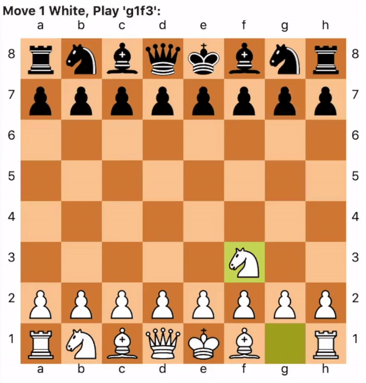

# ai-chess-agent
This project aims to create a chess playing AI agent that can rationally pick moves and win a reasonable number of times.

ai-chess-agent



## Installation
> OS Setup  
> Anaconda Setup  
> PyCharm Professional Setup  
> Version Control  
> Conda Environment  
> Python-Chess  
> Stockfish  

#### OS Setup
 - Download Ubuntu Image ISO  
    - [18.04.3 LTS](https://ubuntu.com/download/desktop/thank-you?version=18.04.3&architecture=amd64)
 - Download Virtual Box or VMware
 - Install OS as a VM
 

###### install compiler dependencies:
```sh
$ sudo apt-get update
$ sudo apt-get install git make gcc g++
```

#### Anaconda Setup
###### install GUI dependencies:
```sh
$ sudo apt-get install libgl1-mesa-glx libegl1-mesa libxrandr2 libxrandr2 libxss1 libxcursor1 libxcomposite1 libasound2 libxi6 libxtst6
```
###### make temporary dir and download anaconda package:
```sh
$ cd ~
$ mkdir tmp
$ cd tmp
$ wget https://repo.anaconda.com/archive/Anaconda3-2019.10-Linux-x86_64.sh
```

###### check the hash
check against https://docs.anaconda.com/anaconda/install/hashes/Anaconda3-2019.10-Linux-x86_64.sh-hash/
```sh
$ sha256sum https://repo.anaconda.com/archive/Anaconda3-2019.10-Linux-x86_64.sh
```

###### install package
```sh
$ bash ~/home/<your-username>/tmp/Anaconda3-2019.10-Linux-x86_64.sh`
```
- press `enter` key several times for agreement 
- type `yes` for default install location
- type `yes` to initialize Anaconda3 when installer complete 
   
###### reset terminal window for installation to complete
```sh
$ source ~/.bashrc
```
###### verify anaconda install
```sh
$ conda list
```
###### verify python install
```sh
$ python
```
then 
```sh
$ quit()
```
###### verify anaconda-navigator install
```sh
$ anaconda-navigator
```
then 
```sh
$ ^C
```

#### PyCharm Professional Setup
###### download jet-brains toolbox tarball to tmp dir 
```sh
$ wget https://download.jetbrains.com/toolbox/jetbrains-toolbox-1.16.6067.tar.gz
```
###### extract tarball to /opt dir
```sh
$ sudo tar -xzf jetbrains-toolbox-1.16.6067.tar.gz -C /opt
```
###### execute the jetbrains-toolbox binary and install PyCharm Professional 2019.3 from the popup message
```sh
$ cd /opt/jetbrains-toolbox-1.16.6067
$ ./jetbrains-toolbox
```
###### register licence
- login to jetbrains-toolbox with JetBrains username and password approve application  
- open PyCharm Professional from the toolbox activate licence with JetBrains username and password

#### Version Control
###### setup Git
where <name> and <email> are your username and email  
`git config --global user.name "<name>"
git config --global user.email "<email>"`  
###### setup PyCharm GitHub VCS
- open PyCharm and setup IDE, login to GitHub
- If you are a contributor:
    - select get from version control
    - select ai-chess-agent and clone  
- Otherwise:
    - make a new PyCharm project
    - `$ git clone https://github.com/masonleon/ai-chess-agent.git ~/PycharmProjects/`

#### Conda Environment
###### create env
```sh
$ conda create --name ai-chess-agent python=3.6
$ conda install -n ai-chess-agent numpy pandas matplotlib
```
###### configure PyCharm project interpreter
select Conda Environment, existing environment  
  
- Interpereter: `/home/<your-username>/anaconda3/envs/ai-chess-agent/bin/python`  
- Conda Executable:	`/home/<your-username>/anaconda3/bin/conda`
- Make Available to all Projects: `Yes` 

#### Python-Chess
###### install to the env
```sh
$ cd ~/PycharmProjects/ai-chess-agent
$ conda activate ai-chess-agent
$ pip install python-chess
```

#### Stockfish
###### clone stockfish repo
```sh
$ git clone https://github.com/official-stockfish/Stockfish.git ~/PycharmProjects/ai-chess-agent
```
###### make the stockfish executable
```sh
$ cd Stockfish/src
$ make build ARCH=x86-64 COMP=gcc
```
###### make new engine dir and copy the stockfish executable
```sh
$ mkdir -p ~/PycharmProjects/ai-chess-agent/src/stockfish_engine/test && cp stockfish "$_"
```
